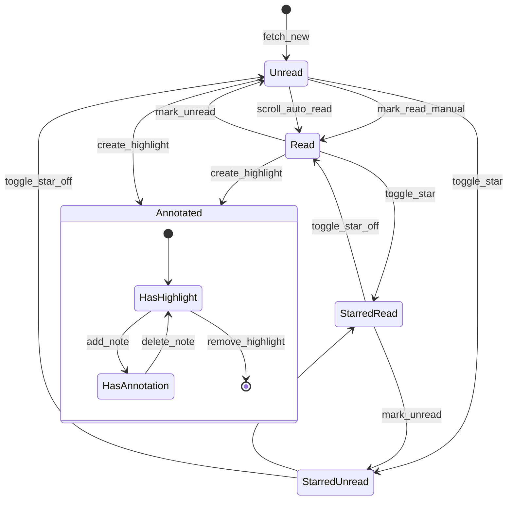
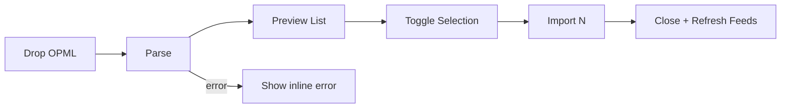

# Lumina Reader 交互设计文档

| 属性 | 值 |
|------|-----|
| 文档版本 | 0.1.0-draft |
| 最后更新 | 2026-05-28 |
| 关联文档 | [产品需求](./01-产品需求文档.md) · [技术方案](./03-技术方案设计.md) |

---

## 1. 设计原则

- **轻盈**：默认 200–300ms 过渡，无弹跳（除右滑释放的轻微弹性）。
- **可预测**：同一操作在所有视图下反馈一致。
- **键盘优先**：所有核心路径可脱离鼠标完成。
- **减少打断**：默认内联微反馈，避免 Toast 滥用。

### 1.1 全局缓动曲线

```css
--ease-standard: cubic-bezier(0.22, 0.61, 0.36, 1);
--ease-enter: cubic-bezier(0.16, 1, 0.3, 1);
--ease-exit: cubic-bezier(0.4, 0, 1, 1);
```

`prefers-reduced-motion: reduce` 时：所有 `transform` 位移置 0，时长 ×0.5。

---

## 2. 动效参数表

| 场景 | 时长 | 属性 | 曲线 | 备注 |
|------|------|------|------|------|
| 列表视图切换 | 200ms | opacity | standard | 旧视图 fade out 100ms → 新视图 fade in 100ms |
| 阅读面板载入 | 300ms | opacity, transform | enter | `translateX(16px)` → `0` |
| 阅读面板关闭（移动） | 250ms | opacity, transform | exit | 反向 |
| 侧栏折叠/展开 | 200ms | width | standard | 宽度动画，内容 opacity 延迟 50ms |
| 星标轻弹 | 120ms | transform | enter | scale `1 → 1.18 → 1` |
| 已读微闪 | 160ms | opacity | standard | `1 → 0.4 → 1`，仅指示线区域 |
| 焦点模式进入 | 280ms | opacity, backdrop-filter | enter | 侧栏 opacity 0，阅读区扩展 |
| 焦点模式退出 | 220ms | 同上 | exit | 恢复滚动位置，无动画滚动 |
| 选中菜单出现 | 150ms | opacity, transform | enter | `translateY(4px)` → `0` |
| 批注侧栏滑入 | 250ms | transform | enter | `translateX(100%)` → `0` |
| 骨架屏脉冲 | 1200ms | opacity | 线性循环 | `0.4 ↔ 0.7`，内容加载完立即停止 |
| 底部导航隐藏 | 200ms | transform | exit | `translateY(0)` → `translateY(100%)` |

---

## 3. 键盘快捷键

### 3.1 作用域定义

| 作用域 | 条件 |
|--------|------|
| **Global** | 应用已聚焦，且无输入框聚焦 |
| **List** | 文章列表区域聚焦或最近交互在列表 |
| **Reader** | 阅读面板聚焦且非焦点模式全屏编辑批注 |
| **Focus** | 焦点模式全屏 |

### 3.2 快捷键映射表

| 按键 | 作用域 | 行为 |
|------|--------|------|
| `J` | List | 选中下一篇文章，列表滚动跟随 |
| `K` | List | 选中上一篇文章 |
| `Enter` | List | 打开当前选中文章至阅读面板 |
| `J` / `K` | Reader | 阅读面板内切换上/下篇（不改变列表滚动） |
| `V` | List, Reader | 新标签页打开原文 URL |
| `S` | List, Reader | 切换当前文章星标 |
| `M` | List, Reader | 切换当前文章已读/未读 |
| `A` | List | 将当前过滤结果全部标为已读（需确认） |
| `F` | Reader | 进入焦点模式 |
| `Esc` | Focus | 退出焦点模式 |
| `Esc` | Reader | 取消文字选中 / 关闭批注侧栏 |
| `/` | Global | 聚焦顶部搜索框 |
| `?` | Global | 打开快捷键帮助浮层 |
| `1` `2` `3` | List | 切换紧凑/卡片/标题流视图 |
| `Tab` | Global | 按视觉顺序移动焦点（见 §8） |

### 3.3 列表与阅读面板差异说明

- **List 下 J/K**：更新 `selectedId` 并高亮列表项（左侧 3px 线仍随已读状态，不自动标已读）。
- **Reader 下 J/K**：切换文章时触发 300ms 面板过渡；若下一篇未加载则显示骨架屏。
- **自动已读**：仅由滚动列表离开视口触发（见 §6），非 J/K 导航触发。

---

## 4. 鼠标、悬停与手势

### 4.1 桌面悬停

| 元素 | 悬停效果 |
|------|----------|
| 列表项 | 背景 `var(--bg-tertiary)`，cursor: pointer，**无 scale** |
| 侧栏源/分组 | 同上 |
| 折叠热区（2px） | 200ms 延迟后展开侧栏至上次宽度 |
| 链接 | 下划线 accent，opacity 不变 |
| 操作条按钮 | opacity 0.7 → 1 |

### 4.2 侧栏折叠热区

- 宽度：**2px** 全高，位于视口最左缘。
- 鼠标进入后 **200ms** 展开；离开侧栏区域 **300ms** 后折叠（若未固定展开）。
- 拖拽分隔条：4px 宽 hit area，双向调整列表/侧栏宽度。

### 4.3 移动端手势（P7）

| 手势 | 参数 | 结果 |
|------|------|------|
| 右滑文章项 | 触发阈值 **80px**；最大滑动 **120px** | 露出「Read Later」「Mark as Read」 |
| 释放 < 40px | 弹性回弹，刚度 180，阻尼 22 | 恢复原位 |
| 释放 ≥ 80px | 吸附至操作位 | 保持露出直至点击或左滑收回 |
| 长按 | **500ms** | 进入多选模式 + 触觉反馈（若支持） |
| 左滑收回 | 任意 | 关闭操作按钮 |

### 4.4 上下文菜单（桌面右键 / 移动长按列表项）

```
┌─────────────────────┐
│ Mark as Read        │
│ Read Later          │
│ Star / Unstar       │
│ Open Original       │
│ ─────────────────   │
│ Copy Link           │
└─────────────────────┘
```

---

## 5. 状态流转

### 5.1 文章状态机



### 5.2 UI 同步规则

| 状态变更 | 列表 | 侧栏未读数 | 阅读面板 |
|----------|------|------------|----------|
| 标为已读 | 3px 线消失 + 160ms 微闪 | 对应源 -1 | 操作条勾选态更新 |
| 加星 | 星标 120ms 轻弹 | 不变 | 星标填充 |
| 添加高亮 | 可选显示批注角标 | 不变 | 正文高亮 + 序号 |
| 删除文章 | 项移除动画 200ms fade | 重算 | 关闭或切下一篇 |

---

## 6. 滚动自动已读

**条件**（全部满足）：

1. 设置 `autoMarkReadOnScroll === true`
2. 列表项 **顶部** 曾进入视口 ≥50% 高度
3. 该项 **完全离开** 视口后持续 **2000ms**
4. 当前非多选模式

**排除**：稍后读文章、当前正在阅读面板打开的文章。

---

## 7. 焦点模式（P3）

### 7.1 进入

1. 用户按 `F` 或点击操作条扩展图标。
2. 左右栏 `opacity: 1 → 0`，`pointer-events: none`，280ms。
3. 阅读区 `max-width` 保持 720px 居中，外层遮罩 `backdrop-filter: blur(24px)`。
4. 记录 `scrollTop` 至 `settings.focusModeLastScroll[articleId]`。
5. 显示「Exit Focus Mode」按钮（左上角，opacity 0.9）。

### 7.2 退出

1. `Esc` 或点击 Exit。
2. 侧栏恢复，220ms。
3. 阅读区 `scrollTop` 恢复进入前数值（**禁止** smooth scroll）。
4. 列表栏保持进入前的选中项。

### 7.3 背景模糊

```css
.focus-backdrop {
  background: color-mix(in srgb, var(--bg-primary) 85%, transparent);
  backdrop-filter: blur(24px);
  -webkit-backdrop-filter: blur(24px);
}
```

---

## 8. 阅读面板交互细节

### 8.1 顶部操作条渐显

| 滚动位置 | opacity |
|----------|---------|
| `scrollTop < 40px` | 0.6 |
| `40px – 120px` | 线性插值 0.6 → 1 |
| `scrollTop > 120px` | 1 |

### 8.2 文字选中浮动菜单（P8）

- 选区变化后 **debounce 80ms** 显示菜单。
- 菜单定位于选区上方 8px，视口边缘自动翻转至下方。
- 菜单宽：紧凑三按钮横排，padding 8px 12px，圆角 6px，背景 `--bg-secondary`，1px border。
- 点击「Annotate」：菜单关闭，批注侧栏 250ms 滑入，焦点置入输入框。

### 8.3 批注侧栏（P9）

- 宽度：320px（桌面），100%（移动）。
- 每条：序号 badge + 引用片段（最多 60 字）+ 批注正文 + 时间。
- 点击条目：正文滚动至对应高亮，`scroll-margin-top: 80px`。
- 关闭：X 按钮 / `Esc` / 点击遮罩（仅移动）。

---

## 9. 反馈分级

| 级别 | 使用场景 | 形式 |
|------|----------|------|
| L0 静默 | 切换视图、悬停 | 无文字 |
| L1 内联微反馈 | 星标、已读、复制 | 图标动画 / 旁侧文字 1.5s 消失 |
| L2 内联条 | 全文提取失败 | 阅读区底部固定条 |
| L3 Toast | 导入成功、导出完成 | 底部居中，3s，可手动关闭 |
| L4 对话框 | 删除订阅源、全部标已读 | 居中模态，需确认/取消 |

**原则**：L3 及以上每日使用不超过用户操作数的 10%（产品目标，非硬性技术限制）。

---

## 10. 错误与空态

| 场景 | 文案（英文 UI） | 操作 |
|------|-----------------|------|
| 无订阅源 | "No feeds yet. Import OPML or add a feed." | 按钮 Import OPML |
| 列表无文章 | "All caught up." | — |
| 抓取失败 | "Couldn't fetch feed. Tap for details." | 侧栏感叹号详情 |
| 全文失败 | "Full text unavailable." | Open Original |
| 离线无缓存 | "You're offline. Showing saved articles only." | 顶部细条 |
| 搜索无结果 | "No articles match your search." | 清除搜索 |

---

## 11. 导入 OPML 流程（P6）



- 拖拽任意区域：全屏半透明遮罩 + 虚线框。
- 重复 `feedUrl`：项显示 "Duplicate" 标签，默认取消勾选。
- 导入中：按钮 loading 态为骨架脉冲，非 Spinner。

---

## 12. 可访问性交互

### 12.1 焦点环

```css
:focus-visible {
  outline: 2px solid var(--accent);
  outline-offset: 2px;
}
```

### 12.2 Tab 顺序

1. 跳过链接（Skip to main content）
2. 侧栏可聚焦项（分组、源）
3. 列表工具栏（搜索、视图、开关）
4. 文章列表项（虚拟列表内 roving tabindex）
5. 阅读面板操作条
6. 文章正文链接
7. 批注侧栏（打开时插入顺序）

### 12.3 屏幕阅读器

| 元素 | 朗读 |
|------|------|
| 未读文章 | "Unread, {title}, {source}, {time}" |
| 列表视图切换 | "Compact list view, selected" |
| 标为已读 | aria-live="polite"："Marked as read" |
| 高亮 | "Highlight {n} on passage: {excerpt}" |

### 12.4 对比度与触摸目标

- 可点击区域最小 **44×44px**（移动）。
- 列表紧凑模式行高可小于 44px，但点击热区通过 padding 扩展至 44px。

---

## 13. 设置页交互（P5）

- 主题卡片：单击立即应用，无需保存按钮。
- 字体/字号：实时预览阅读面板（若已打开文章）。
- 开关：切换即持久化至 IndexedDB。

---

## 14. 边界情况汇总

| 情况 | 行为 |
|------|------|
| 快速连按 J | 防抖 50ms，仅末次生效 |
| 阅读中删除当前源 | 弹 L4 确认；确认后切至列表首项 |
| 焦点模式下来新文章通知 | 不打断；角标待退出后显示 |
| 批注输入未保存关闭 | 内联确认 "Discard note?" |
| 窗口宽度 <768px | 自动切换移动布局，不保留三栏 |

---

*动效与快捷键变更须同步 [产品需求文档](./01-产品需求文档.md) 与 [测试策略](./05-测试策略.md)。*
