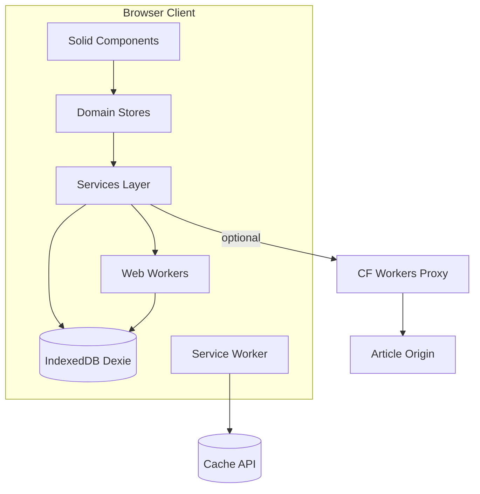
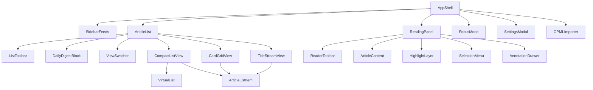
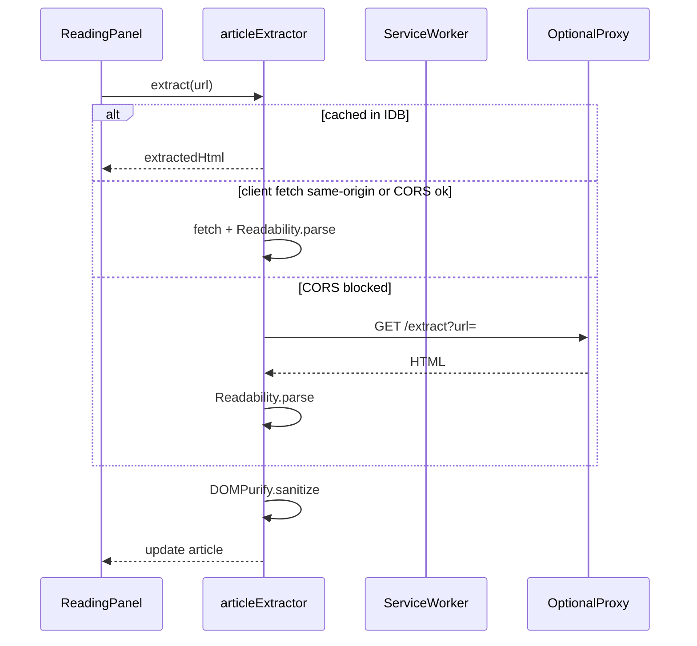

# Lumina Reader 技术方案设计文档

| 属性 | 值 |
|------|-----|
| 文档版本 | 0.1.0-draft |
| 最后更新 | 2026-05-28 |
| 关联文档 | [产品需求](./01-产品需求文档.md) · [数据模型](./04-数据模型与接口.md) · [交互设计](./02-交互设计文档.md) |

---

## 1. 技术选型总览

| 层级 | 主选（推荐） | 备选 |
|------|-------------|------|
| 框架 | **SolidJS** + TypeScript | SvelteKit + TypeScript |
| 构建 | Vite 6 | Vite 6 |
| 路由 | `@solidjs/router` | SvelteKit 文件路由 |
| 状态 | `solid-js/store` + 领域 stores | Svelte 5 runes (`$state` / `$derived`) |
| 样式 | Vanilla CSS + CSS Variables | 同左 |
| 持久化 | Dexie.js → IndexedDB | 同左 |
| PWA | `vite-plugin-pwa` (Workbox) | 同左 |
| 全文提取 | `@mozilla/readability` + `dompurify` | 同左 |
| 本地 AI | `@xenova/transformers` (Transformers.js) | 同左 |
| 虚拟列表 | `@solid-primitives/virtual` | `@tanstack/svelte-virtual` |
| 测试 | Vitest + Playwright + axe-core | 同左 |

**不采用**：Tailwind（避免工具类噪音）、重型 UI 组件库（视觉需完全自控）。

### 1.1 选型理由（SolidJS 主选）

- **细粒度响应式**：文章列表 1000+ 条时仅更新变更 DOM，利于阅读器高频列表刷新。
- **无 Virtual DOM**：交互微动效与滚动性能更可控。
- **包体小**：契合 PWA 离线壳体积预算。
- **备选 SvelteKit**：若需 SSR/文件路由一体化或团队更熟 Svelte，可平移组件划分与数据层设计。

---

## 2. 系统架构



### 2.1 分层职责

| 层 | 职责 |
|----|------|
| **Components** | 纯展示与局部 UI 状态；通过 stores 读写数据 |
| **Stores** | 可观察的应用状态、选择器、派生未读数 |
| **Services** | 副作用：抓取 RSS、全文提取、OPML 解析、导出、AI 调度 |
| **Workers** | AI 嵌入、聚类、FlexSearch 索引构建 |
| **IDB** | 唯一持久化真相源 |
| **Service Worker** | 壳与文章资源缓存、离线回退 |

---

## 3. 项目目录结构

```
lumina_reader/
├── public/
│   ├── manifest.webmanifest
│   └── icons/
├── src/
│   ├── app/
│   │   ├── App.tsx
│   │   ├── routes.tsx
│   │   └── providers.tsx
│   ├── components/
│   │   ├── layout/
│   │   │   ├── AppShell.tsx
│   │   │   ├── SidebarFeeds.tsx
│   │   │   ├── ResizablePane.tsx
│   │   │   └── MobileNav.tsx
│   │   ├── list/
│   │   │   ├── ArticleList.tsx
│   │   │   ├── CompactListView.tsx
│   │   │   ├── CardGridView.tsx
│   │   │   ├── TitleStreamView.tsx
│   │   │   └── ArticleListItem.tsx
│   │   ├── reader/
│   │   │   ├── ReadingPanel.tsx
│   │   │   ├── ReaderToolbar.tsx
│   │   │   ├── ArticleContent.tsx
│   │   │   ├── HighlightLayer.tsx
│   │   │   ├── SelectionMenu.tsx
│   │   │   └── AnnotationDrawer.tsx
│   │   ├── focus/
│   │   │   └── FocusMode.tsx
│   │   ├── settings/
│   │   │   └── SettingsModal.tsx
│   │   ├── import/
│   │   │   └── OPMLImporter.tsx
│   │   └── common/
│   │       ├── Skeleton.tsx
│   │       ├── Icon.tsx
│   │       └── Toast.tsx
│   ├── stores/
│   │   ├── feedsStore.ts
│   │   ├── articlesStore.ts
│   │   ├── selectionStore.ts
│   │   ├── settingsStore.ts
│   │   ├── aiStore.ts
│   │   └── syncStore.ts
│   ├── services/
│   │   ├── feedFetcher.ts
│   │   ├── articleExtractor.ts
│   │   ├── opmlParser.ts
│   │   ├── highlightService.ts
│   │   ├── searchIndexService.ts
│   │   ├── exportService.ts
│   │   └── sync/
│   │       ├── SyncAdapter.ts
│   │       └── LocalSyncAdapter.ts
│   ├── workers/
│   │   ├── ai.worker.ts
│   │   └── searchIndex.worker.ts
│   ├── db/
│   │   ├── database.ts
│   │   └── repositories/
│   ├── styles/
│   │   ├── tokens.css
│   │   ├── themes/
│   │   │   ├── dark.css
│   │   │   ├── warm.css
│   │   │   └── cold.css
│   │   └── global.css
│   ├── types/
│   │   └── index.ts          # 与文档 04 同步
│   └── utils/
│       ├── textQuote.ts
│       ├── relativeTime.ts
│       └── nlFilter.ts
├── vite.config.ts
├── tsconfig.json
└── doc/
```

---

## 4. 组件树与复用策略



### 4.1 列表多视图复用

- `ArticleList` 持有**唯一**过滤后 `articles` 信号（来自 `articlesStore` + 当前 `feedId/smartGroupId/tag`）。
- 三视图仅为不同 `rowRenderer`，共享：
  - `ArticleListItem`（props: `article`, `viewMode`, `selected`, `onOpen`, `onToggleRead`…）
  - 虚拟滚动容器 `VirtualList`
- 切换视图时 **不重新请求数据**，仅切换 renderer + 200ms CSS transition。

### 4.2 阅读面板与高亮安全插入

- `ArticleContent` 渲染经 **DOMPurify** 消毒后的 HTML。
- `HighlightLayer` 使用 **CSS Custom Highlight API**（`::highlight(lumina-N)`）优先；不支持时 fallback 为包裹 `<mark>`（消毒后白名单允许 `mark[data-highlight-id]`）。
- 不在 React/Solid 组件树内直接 mutate 用户 HTML 结构；高亮恢复在 `onMount` + `extractedText` 就绪后由 `highlightService.applyAll(articleId)` 执行。

---

## 5. 状态模型（Stores）

### 5.1 Store 切片

| Store | 状态 | 主要 Actions |
|-------|------|--------------|
| `feedsStore` | `feeds[]`, `smartGroups[]`, `activeFeedId`, `activeGroupId` | `loadAll`, `addFeed`, `removeFeed`, `refreshFeed` |
| `articlesStore` | `items[]`, `filter`, `loading`, `selectedId` | `loadPage`, `markRead`, `toggleStar`, `setFilter` |
| `selectionStore` | `multiSelectIds`, `isMultiSelectMode` | `toggleSelect`, `clear`, `batchMarkRead` |
| `settingsStore` | `UserSettings` | `setTheme`, `setFontTier`, `persist` |
| `aiStore` | `clusteringStatus`, `digest`, `modelReady` | `runClustering`, `generateDigest` |
| `syncStore` | `adapter`, `lastSync`, `pendingChanges` | `push`, `pull` |

### 5.2 数据流示例（打开文章）

```
ArticleListItem.onClick
  → articlesStore.select(id)
  → articlesStore.loadFullContent(id)  // 若 extractedHtml 缺失
  → articleExtractor.extract(url)
  → db.articles.update(id, { extractedHtml, extractStatus })
  → ReadingPanel 响应 selectedId + article 信号更新
  → highlightService.applyAll(id)
```

### 5.3 SolidJS Store 示例骨架

```typescript
import { createStore } from 'solid-js/store';
import { createRoot } from 'solid-js';

function createArticlesStore() {
  const [state, setState] = createStore({
    items: [] as Article[],
    selectedId: null as string | null,
    filter: { unreadOnly: false, query: '' },
  });

  return {
    state,
    async select(id: string) {
      setState('selectedId', id);
      await loadFullContent(id);
    },
    async markRead(id: string, isRead: boolean) {
      await db.articles.update(id, { isRead, readAt: isRead ? new Date().toISOString() : undefined });
      setState('items', (item) => item.id === id, 'isRead', isRead);
      feedsStore.refreshUnreadCounts();
    },
  };
}

export const articlesStore = createRoot(createArticlesStore);
```

---

## 6. 全文提取方案

### 6.1 流程



### 6.2 实现要点

```typescript
import { Readability } from '@mozilla/readability';
import DOMPurify from 'dompurify';

export async function extractArticleFromHtml(html: string, url: string) {
  const doc = new DOMParser().parseFromString(html, 'text/html');
  doc.documentURI = url;
  const reader = new Readability(doc);
  const article = reader.parse();
  if (!article?.content) return { extractStatus: 'failed' as const };
  const sanitized = DOMPurify.sanitize(article.content, {
    ADD_TAGS: ['mark'],
    ADD_ATTR: ['data-highlight-id'],
  });
  return {
    extractStatus: 'success' as const,
    extractedHtml: sanitized,
    extractedText: article.textContent ?? '',
    title: article.title,
  };
}
```

### 6.3 Cloudflare Workers 代理骨架（可选）

```typescript
// workers/extract-proxy/src/index.ts
export default {
  async fetch(request: Request): Promise<Response> {
    const url = new URL(request.url).searchParams.get('url');
    if (!url) return new Response('Missing url', { status: 400 });
    const res = await fetch(url, { headers: { 'User-Agent': 'LuminaReader/1.0' } });
    return new Response(res.body, {
      headers: { 'Content-Type': res.headers.get('Content-Type') ?? 'text/html' },
    });
  },
};
```

用户于设置中填写 `extractProxyUrl`；未配置且 CORS 失败则 `extractStatus: 'fallback'`。

---

## 7. 本地 AI 实现

### 7.1 能力矩阵

| 功能 | 模型/算法 | 运行环境 |
|------|-----------|----------|
| 文章嵌入 | `Xenova/all-MiniLM-L6-v2` | `ai.worker.ts` |
| 智能分组聚类 | k-means (k=4~6) 于嵌入向量 | Worker |
| 标签提取 | TextRank 关键词 + 可选 MiniLM 重排 | Worker |
| 今日摘要 | 抽取式：Top3 句 TextRank + 模板拼接 | Worker |
| 自然语言过滤 v1 | chrono-node + 关键词规则 | 主线程 |

### 7.2 调度策略

```typescript
// services/aiScheduler.ts
const CHUNK_BUDGET_MS = 16;

export function scheduleEmbedding(articleIds: string[]) {
  const run = (deadline?: IdleDeadline) => {
    while (articleIds.length && (deadline?.timeRemaining() ?? 50) > CHUNK_BUDGET_MS) {
      const id = articleIds.pop()!;
      aiWorker.postMessage({ type: 'embed', articleId: id });
    }
    if (articleIds.length) {
      requestIdleCallback(run);
    }
  };
  requestIdleCallback(run);
}
```

- 模型首次使用按需下载，缓存至 IndexedDB / Cache API（`transformers-cache`）。
- `settings.aiEnabled === false` 时跳过所有 AI 任务。
- UI 显示 `aiStore.modelReady` 与非阻塞进度（侧栏小字，非弹窗）。

### 7.3 k-means 分组

- 对未分组文章嵌入向量聚类，映射到预设标签：技术前沿 / 深度长文 / 轻快简讯（按平均字数 + 标题长度启发式辅助）。
- 用户手动规则组优先，不被 AI 覆盖。

---

## 8. 离线与 Service Worker

### 8.1 缓存策略表

| 资源类型 | 策略 | 命名缓存 | 备注 |
|----------|------|----------|------|
| `index.html`, JS, CSS | CacheFirst | `lumina-shell-v*` | 版本 hash 更新 |
| 字体文件 | CacheFirst | `lumina-fonts-v1` | 长期缓存 |
| RSS 请求 | NetworkFirst | — | 在线优先 |
| 文章 HTML | StaleWhileRevalidate | `lumina-articles` | 最多 100 篇 LRU |
| 文内图片 | CacheFirst | `lumina-images` | 计入 LRU |
| Favicon | CacheFirst | `lumina-favicons` | 小体积 |

### 8.2 LRU 实现

- 每次成功缓存文章：写 `cacheMeta`，`lastAccessedAt = now`。
- 超过 100 篇：按 `lastAccessedAt` 升序删除 Cache + `cacheMeta` 记录。
- 离线时：Network 失败回退到 Cache；无缓存则 UI 显示摘要 + 离线提示。

### 8.3 vite-plugin-pwa 配置要点

```typescript
VitePWA({
  registerType: 'autoUpdate',
  workbox: {
    globPatterns: ['**/*.{js,css,html,ico,svg,woff2}'],
    runtimeCaching: [/* 见上表 */],
  },
  manifest: {
    name: 'Lumina Reader',
    short_name: 'Lumina',
    theme_color: '#0f0f0f',
    background_color: '#0f0f0f',
    display: 'standalone',
  },
});
```

---

## 9. 性能策略

| 场景 | 方案 |
|------|------|
| 长列表 | `@solid-primitives/virtual`，预估行高 80px（compact）/ 200px（cards） |
| 骨架屏 | 组件 `Skeleton` 与真实布局共享 CSS 变量尺寸 |
| 主题切换 | 仅切换 `document.documentElement.dataset.theme`，禁止 remount 列表 |
| 搜索 | FlexSearch 索引在 Worker 构建，主线程查询 <5ms |
| 图片 | `loading="lazy"` + SW 缓存 |
| 包体 | 路由级 code split；Transformers.js 动态 `import()` |

### 9.1 性能埋点

```typescript
performance.mark('article-open-start');
// ... load content
performance.mark('article-open-end');
performance.measure('article-open', 'article-open-start', 'article-open-end');
```

开发环境上报至 console；生产可选匿名统计（默认关闭）。

---

## 10. RSS 抓取

- 使用 `feedsmith` 或 `rss-parser` 解析 RSS/Atom。
- 定时：`setInterval` + Page Visibility API（隐藏时降频）。
- 去重：`guid` 或 `hash(url)`。
- 失败：`consecutiveFailures++`，成功归零；≥3 触发 UI 感叹号。

---

## 11. 同步接口预留

见 [数据模型 §7](./04-数据模型与接口.md#7-预留-rest-api-草案)。

客户端实现：

```typescript
export class NoneSyncAdapter implements SyncAdapter {
  readonly kind = 'none';
  async pull() { return { changes: [] }; }
  async push() { return { accepted: 0 }; }
}
```

未来路径：

1. **REST + LWW**：实现简单，多设备可能冲突。
2. **CRDT（Yjs）**：批注/高亮协同编辑；复杂度高，v0.5+ 考虑。

---

## 12. 安全考量

- 所有 `innerHTML` 必须经 DOMPurify。
- OPML 解析防 XXE：浏览器端 DOMParser 不加载外部实体，但仍限制文件大小 ≤5MB。
- 代理 Worker 需 URL 白名单或域名速率限制，防 SSRF 滥用。
- Content-Security-Policy：`default-src 'self'`；`img-src * data:`；`connect-src 'self' https:`。

---

## 13. SvelteKit 备选迁移说明

| Solid 概念 | Svelte 对应 |
|------------|-------------|
| `createSignal` | `$state` |
| `createStore` | `$state` 对象 + 细粒度赋值 |
| `createEffect` | `$effect` |
| `@solidjs/router` | SvelteKit `+page.svelte` |
| `@solid-primitives/virtual` | `@tanstack/svelte-virtual` |

组件文件划分可 1:1 映射，业务逻辑层（services/db/workers）**完全复用**。

---

## 14. 开发环境要求

- Node.js ≥20
- pnpm ≥9
- 浏览器：Chrome/Edge 120+、Firefox 121+、Safari 17+（CSS Highlight API 需检测 fallback）

---

*实现变更须同步更新 [数据模型](./04-数据模型与接口.md)、[测试策略](./05-测试策略.md) 及 [CHANGELOG](./CHANGELOG.md)。*
