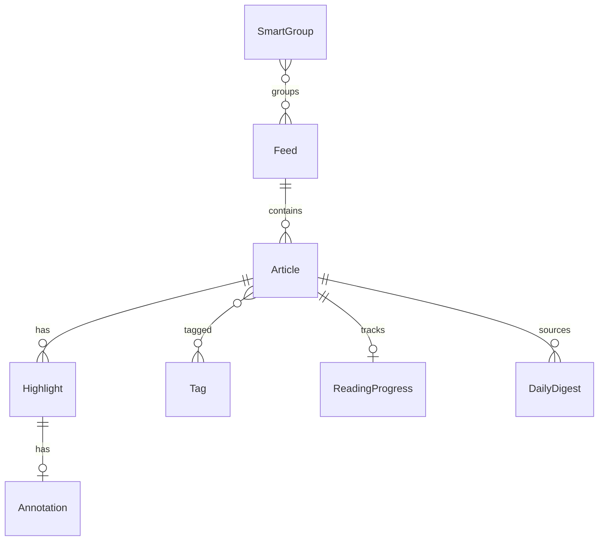

# Lumina Reader 数据模型与接口文档

| 属性 | 值 |
|------|-----|
| 文档版本 | 0.1.0-draft |
| 最后更新 | 2026-05-28 |
| 关联文档 | [产品需求](./01-产品需求文档.md) · [技术方案](./03-技术方案设计.md) |

---

## 1. 概述

Lumina Reader 采用**本地优先**架构：所有核心实体持久化于 IndexedDB（通过 Dexie.js 封装）。本文档定义 TypeScript 类型、数据库 Schema、导入导出格式及预留 REST API，作为组件开发、存储实现与未来同步的**唯一契约源**。

---

## 2. 核心实体 TypeScript 定义

以下类型可直接拷贝至 `src/types/` 使用。

```typescript
/** 通用 ID 与时间戳 */
export type EntityId = string; // UUID v4
export type ISODateTime = string; // ISO 8601

/** 全文提取状态 */
export type ExtractStatus = 'success' | 'fallback' | 'failed' | 'pending';

/** 主题 */
export type ThemeId = 'dark' | 'warm' | 'cold';

/** 列表视图模式 */
export type ListViewMode = 'compact' | 'cards' | 'titles';

/** 字号 / 行高档位 */
export type SizeTier = 'sm' | 'md' | 'lg';

/** 正文字体族 */
export type BodyFontFamily = 'serif' | 'sans';

// ─── Feed（订阅源）────────────────────────────────────────

export interface Feed {
  id: EntityId;
  name: string;
  feedUrl: string;           // RSS/Atom XML URL
  siteUrl?: string;          // 站点首页
  faviconUrl?: string;
  description?: string;

  /** 所属智能分组 ID 列表（多对多） */
  smartGroupIds: EntityId[];

  lastFetchedAt?: ISODateTime;
  lastPublishedAt?: ISODateTime;  // 源内最新文章发布时间
  consecutiveFailures: number;    // ≥3 时 UI 显示感叹号
  lastError?: string;

  unreadCount: number;        // 冗余字段，便于侧栏展示，由 articles 聚合刷新
  isArchived: boolean;
  sortOrder: number;

  createdAt: ISODateTime;
  updatedAt: ISODateTime;
}

// ─── Article（文章）──────────────────────────────────────

export interface Article {
  id: EntityId;
  feedId: EntityId;

  title: string;
  author?: string;
  url: string;                // 原文链接
  guid: string;               // RSS guid 或 url 哈希，用于去重

  summary?: string;           // RSS 摘要纯文本
  contentHtml?: string;       // RSS 内嵌 HTML
  extractedHtml?: string;     // Readability 提取结果
  extractedText?: string;     // 纯文本，供 AI / 搜索索引

  extractStatus: ExtractStatus;

  publishedAt: ISODateTime;
  fetchedAt: ISODateTime;

  isRead: boolean;
  readAt?: ISODateTime;
  isStarred: boolean;
  isReadLater: boolean;

  tagIds: EntityId[];
  highlightIds: EntityId[];   // 冗余 ID 列表，主数据在 highlights 表
  annotationIds: EntityId[];

  /** 预估阅读分钟数 */
  readingMinutes?: number;

  thumbnailUrl?: string;

  createdAt: ISODateTime;
  updatedAt: ISODateTime;
}

// ─── Highlight（高亮）──────────────────────────────────────

/**
 * 文本锚点采用 W3C Web Annotation TextQuoteSelector 思路：
 * exact + prefix + suffix 用于正文变更后的模糊恢复
 */
export interface TextQuoteSelector {
  exact: string;
  prefix: string;   // exact 前最多 32 字符
  suffix: string;   // exact 后最多 32 字符
}

export interface Highlight {
  id: EntityId;
  articleId: EntityId;
  selector: TextQuoteSelector;
  color: string;              // 默认 'accent' → CSS var(--highlight-bg)
  charOffsetStart?: number;   // 辅助定位，提取成功时写入
  charOffsetEnd?: number;
  createdAt: ISODateTime;
  updatedAt: ISODateTime;
}

// ─── Annotation（批注）──────────────────────────────────

export interface Annotation {
  id: EntityId;
  articleId: EntityId;
  highlightId: EntityId;
  body: string;
  /** 正文内显示的序号，按文章内创建顺序 1..n */
  markerIndex: number;
  createdAt: ISODateTime;
  updatedAt: ISODateTime;
}

// ─── Tag（标签）────────────────────────────────────────────

export interface Tag {
  id: EntityId;
  name: string;
  slug: string;               // URL 安全，用于过滤
  articleCount: number;       // 冗余计数
  isAuto: boolean;            // 是否由 AI/规则自动生成
  createdAt: ISODateTime;
}

// ─── SmartGroup（智能分组）──────────────────────────────────

export type SmartGroupRuleKind = 'keyword' | 'aiCluster' | 'manual';

export interface SmartGroupRule {
  kind: SmartGroupRuleKind;
  config: KeywordRuleConfig | AiClusterRuleConfig | ManualRuleConfig;
}

export interface KeywordRuleConfig {
  keywords: string[];
  match: 'any' | 'all';
  fields: ('title' | 'summary' | 'extractedText')[];
}

export interface AiClusterRuleConfig {
  clusterId: string;
  label: string;
  embeddingVersion: string;
}

export interface ManualRuleConfig {
  feedIds: EntityId[];
}

export interface SmartGroup {
  id: EntityId;
  name: string;
  rule: SmartGroupRule;
  feedIds: EntityId[];      // manual 或聚合结果
  sortOrder: number;
  isSystem: boolean;          // 内置分组不可删除
  createdAt: ISODateTime;
  updatedAt: ISODateTime;
}

// ─── ReadingProgress（阅读进度）────────────────────────────

export interface ReadingProgress {
  articleId: EntityId;        // 主键
  scrollPercent: number;      // 0–100
  scrollPixel: number;
  lastReadAt: ISODateTime;
}

// ─── DailyDigest（今日摘要）────────────────────────────────

export interface DailyDigest {
  id: EntityId;               // 通常为 YYYY-MM-DD
  date: string;               // 本地日期 YYYY-MM-DD
  summaryText: string;        // ≤3 句
  sourceArticleIds: EntityId[];
  generatedAt: ISODateTime;
}

// ─── UserSettings（用户设置，单行）──────────────────────────

export interface UserSettings {
  id: 'default';              // 固定主键

  theme: ThemeId;
  bodyFontFamily: BodyFontFamily;
  uiFontFamily: 'inter' | 'system';

  fontSizeTier: SizeTier;
  lineHeightTier: SizeTier;

  listViewMode: ListViewMode;
  autoMarkReadOnScroll: boolean;
  sidebarWidth: number;       // px，默认 220
  listWidth: number;          // px

  focusModeLastScroll: Record<EntityId, number>;

  /** AI 功能总开关 */
  aiEnabled: boolean;
  digestEnabled: boolean;

  /** 可选全文代理 */
  extractProxyUrl?: string;

  syncAdapter: 'none' | 'local' | 'remote';
  syncEndpoint?: string;

  updatedAt: ISODateTime;
}

// ─── CacheMeta（PWA / 离线 LRU）────────────────────────────

export type CacheResourceType = 'article-html' | 'article-image' | 'favicon';

export interface CacheMeta {
  id: string;                 // `${type}:${articleId}` 或 URL 哈希
  resourceType: CacheResourceType;
  articleId?: EntityId;
  url: string;
  sizeBytes: number;
  cachedAt: ISODateTime;
  lastAccessedAt: ISODateTime;
}
```

---

## 3. IndexedDB Schema（Dexie）

```typescript
import Dexie, { type Table } from 'dexie';

export class LuminaDatabase extends Dexie {
  feeds!: Table<Feed, EntityId>;
  articles!: Table<Article, EntityId>;
  highlights!: Table<Highlight, EntityId>;
  annotations!: Table<Annotation, EntityId>;
  tags!: Table<Tag, EntityId>;
  articleTags!: Table<{ articleId: EntityId; tagId: EntityId }, [EntityId, EntityId]>;
  smartGroups!: Table<SmartGroup, EntityId>;
  readingProgress!: Table<ReadingProgress, EntityId>;
  digests!: Table<DailyDigest, EntityId>;
  settings!: Table<UserSettings, string>;
  cacheMeta!: Table<CacheMeta, string>;

  constructor() {
    super('LuminaReaderDB');

    this.version(1).stores({
      feeds: 'id, feedUrl, lastFetchedAt, sortOrder, isArchived',
      articles: [
        'id',
        'feedId',
        'guid',
        'publishedAt',
        'fetchedAt',
        'isRead',
        'isStarred',
        'isReadLater',
        'extractStatus',
        '[feedId+publishedAt]',
        '[isRead+publishedAt]',
        '[isStarred+publishedAt]',
      ].join(', '),
      highlights: 'id, articleId, createdAt',
      annotations: 'id, articleId, highlightId, createdAt',
      tags: 'id, slug, name',
      articleTags: '[articleId+tagId], tagId, articleId',
      smartGroups: 'id, sortOrder',
      readingProgress: 'articleId, lastReadAt',
      digests: 'id, date',
      settings: 'id',
      cacheMeta: 'id, resourceType, articleId, lastAccessedAt',
    });
  }
}
```

### 3.1 索引使用说明

| 查询场景 | 使用索引 |
|----------|----------|
| 按源列出文章 | `articles.where('feedId').equals(id)` |
| 未读列表按时间 | `[isRead+publishedAt]`，isRead=0 |
| 星标文章 | `[isStarred+publishedAt]` |
| 去重抓取 | `guid` 唯一性校验 |
| 全文搜索（本地） | 另建 `articles` 的 `extractedText` 非索引字段 + FlexSearch 内存索引（启动时构建） |
| LRU 淘汰缓存 | `cacheMeta.orderBy('lastAccessedAt')` |

### 3.2 版本迁移策略

- `version(n).upgrade(tx => …)` 中执行数据变换。
- 导出 JSON 含 `schemaVersion: 1`，导入时若版本低于当前则运行迁移器。
- 破坏性变更时备份提示用户先导出。

---

## 4. 数据完整性约束

### 4.1 级联删除

| 操作 | 级联 |
|------|------|
| 删除 `Feed` | 删除其下所有 `Article`；清理 `articleTags`；从 `SmartGroup.feedIds` 移除 |
| 删除 `Article` | 删除关联 `Highlight`、`Annotation`、`ReadingProgress`、`articleTags`；更新 `Tag.articleCount` |
| 删除 `Highlight` | 删除关联 `Annotation` |
| 删除 `Tag` | 删除 `articleTags` 联结行 |

### 4.2 Highlight 锚点失效策略

1. 优先用 `charOffsetStart/End` 在 `extractedText` 上定位。
2. 失败则用 `TextQuoteSelector` 模糊匹配（Levenshtein ≤10%）。
3. 仍失败则高亮标记为 `orphaned: true`，侧栏提示「原文已变更，请重新定位」。

### 4.3 冗余字段刷新

- `Feed.unreadCount`：在 `Article.isRead` 变更时增量更新。
- `Tag.articleCount`：在 `articleTags` 变更时重算。

---

## 5. OPML 字段映射

| OPML 属性 | Feed 字段 | 说明 |
|-----------|-----------|------|
| `text` 或 `title` | `name` | 优先 `title` |
| `xmlUrl` | `feedUrl` | 必填 |
| `htmlUrl` | `siteUrl` | 可选 |
| `description` | `description` | 可选 |
| — | `id` | 导入时生成 UUID |
| — | `consecutiveFailures` | 默认 0 |
| — | `smartGroupIds` | 默认空，用户可后续分配 |

### 5.1 导入流程数据

```typescript
export interface OPMLPreviewItem {
  tempId: string;
  name: string;
  feedUrl: string;
  siteUrl?: string;
  selected: boolean;          // 默认 true
  duplicate: boolean;         // 与现有 feedUrl 冲突
}
```

---

## 6. JSON 导出 / 导入 Schema

```typescript
export interface LuminaExportBundle {
  schemaVersion: 1;
  exportedAt: ISODateTime;
  appVersion: string;

  feeds: Feed[];
  articles: Article[];
  highlights: Highlight[];
  annotations: Annotation[];
  tags: Tag[];
  articleTags: Array<{ articleId: EntityId; tagId: EntityId }>;
  smartGroups: SmartGroup[];
  readingProgress: ReadingProgress[];
  digests: DailyDigest[];
  settings: UserSettings;
}

/** 仅带标注文章 */
export interface LuminaAnnotatedExport {
  schemaVersion: 1;
  exportedAt: ISODateTime;
  articles: Array<Article & {
    highlights: Highlight[];
    annotations: Annotation[];
  }>;
}
```

### 6.1 导入校验规则

- `schemaVersion` 必须 ≤ 当前应用支持版本。
- `feedUrl` / `guid` 去重：冲突时提示「跳过 / 覆盖 / 新建副本」。
- 单文件大小建议上限 50MB，超出时分片导入（未来）。

---

## 7. 预留 REST API 草案

> 初期可不实现；接口设计保证与本地实体一致，便于未来同步服务对接。

### 7.1 通用约定

- Base URL：`{syncEndpoint}/v1`
- 认证：`Authorization: Bearer {token}`
- 内容类型：`application/json`
- 错误体：`{ code: string, message: string, details?: unknown }`

### 7.2 Feeds

**GET /feeds**

```json
{
  "items": [ { "id": "...", "name": "...", "feedUrl": "...", "unreadCount": 3 } ],
  "nextCursor": null
}
```

**POST /feeds**

```json
// Request
{ "name": "The Verge", "feedUrl": "https://..." }

// Response 201
{ "id": "uuid", "name": "The Verge", "feedUrl": "https://...", "createdAt": "..." }
```

### 7.3 Articles

**GET /articles?feedId=&isRead=&since=&cursor=**

**PATCH /articles/{id}**

```json
{ "isRead": true, "isStarred": false }
```

### 7.4 全文提取

**POST /articles/extract**

```json
// Request
{ "url": "https://example.com/post" }

// Response
{
  "extractStatus": "success",
  "extractedHtml": "<article>...</article>",
  "extractedText": "...",
  "title": "..."
}
```

### 7.5 同步状态（预留 CRDT / 最后写入胜出）

**PUT /sync/state**

```json
// Request
{
  "clientId": "device-uuid",
  "lastSyncedAt": "2026-05-28T00:00:00Z",
  "entities": {
    "articles": [ { "id": "...", "updatedAt": "...", "patch": { "isRead": true } } ],
    "highlights": []
  }
}

// Response
{
  "serverTime": "2026-05-28T01:00:00Z",
  "conflicts": [],
  "merged": { "articles": 1, "highlights": 0 }
}
```

### 7.6 SyncAdapter 抽象（客户端）

```typescript
export interface SyncAdapter {
  readonly kind: 'none' | 'local' | 'remote';
  pull(cursor?: string): Promise<SyncPullResult>;
  push(changes: SyncPushPayload): Promise<SyncPushResult>;
  resolveConflict(conflict: SyncConflict): Promise<void>;
}
```

---

## 8. 实体关系图



---

## 9. 全文搜索索引（补充）

本地搜索不直接依赖 IndexedDB 索引，而在应用层维护：

```typescript
export interface SearchIndexEntry {
  articleId: EntityId;
  title: string;
  extractedText: string;
  feedName: string;
  publishedAt: number;        // epoch ms
  isRead: boolean;
  tagSlugs: string[];
}
```

重建时机：应用启动增量、文章批量导入后全量、夜间 idle。

---

*类型定义与 Schema 变更须同步更新 [技术方案](./03-技术方案设计.md) 与 [测试策略](./05-测试策略.md) 中的相关用例。*
