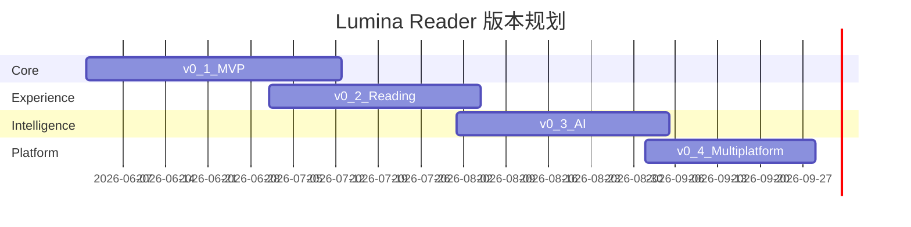

# Lumina Reader 项目管理文档

| 属性 | 值 |
|------|-----|
| 文档版本 | 0.1.0-draft |
| 最后更新 | 2026-05-28 |
| 关联文档 | [产品需求](./01-产品需求文档.md) · [技术方案](./03-技术方案设计.md) |

---

## 1. 项目概述

- **项目名称**：Lumina Reader
- **类型**：个人/小团队独立开发项目
- **交付形态**：PWA 单页应用，本地优先
- **文档驱动**：先 PRD → 数据模型 → 技术/交互 → 测试 → 代码

---

## 2. 迭代规划

### 2.1 版本路线图

### 2.2 v0.1 — MVP（目标：可日常阅读）

**目标**：替代基础 RSS 阅读，无 AI，深色主题，桌面三栏。

| 包含 | 不包含 |
|------|--------|
| OPML 导入预览 | AI 智能分组 |
| 三栏布局 + 拖拽宽度 | 摘要卡片/标题流 |
| 紧凑列表 | 焦点模式 |
| 阅读面板 + Readability | 高亮/批注 |
| 深色主题 | 暖黄/冷白主题 |
| IndexedDB 持久化 | PWA 离线 |
| 手动 SmartGroup | 今日摘要 |
| 键盘 J/K/M/S/V | 移动端 |

**预估周期**：6 周（兼职约 10h/周）

### 2.3 v0.2 — 阅读体验

- 摘要卡片 + 标题流视图
- 焦点模式（P3）
- 高亮 / 批注 / 导出带标注（P8/P9）
- PWA 安装 + 最近 100 篇离线
- 骨架屏加载
- 源失败感叹号、未更新淡点

**预估周期**：5 周

### 2.4 v0.3 — 本地智能

- Transformers.js 嵌入 + k-means 分组
- 今日摘要（≤3 句）
- 自动标签 + 标签云过滤
- 自然语言搜索（chrono + 规则）
- AI 可关闭开关

**预估周期**：5 周

### 2.5 v0.4 — 多主题与移动

- 暖黄 / 冷白主题（P5）
- 移动端单栏 + 底部导航（P4）
- 右滑快捷操作（P7）
- `SyncAdapter` 远程接口 mock + 设置页
- 可选 CF Workers 代理文档

**预估周期**：4 周

---

## 3. 任务分解

### 3.1 v0.1 任务列表

| ID | 任务 | 依赖 | 预估 |
|----|------|------|------|
| T01 | 初始化 Vite + Solid + TS + ESLint | — | 0.5d |
| T02 | Dexie Schema v1 + repositories | T01 | 1d |
| T03 | CSS tokens + dark 主题 | T01 | 1d |
| T04 | AppShell 三栏 + ResizablePane | T03 | 2d |
| T05 | SidebarFeeds 手动分组 | T02,T04 | 1.5d |
| T06 | RSS fetcher + 定时刷新 | T02 | 2d |
| T07 | ArticleList compact + virtual | T02,T04 | 2d |
| T08 | ReadingPanel + Readability | T06,T07 | 2.5d |
| T09 | OPML 解析 + 导入预览 UI | T02,T05 | 2d |
| T10 | settingsStore 基础持久化 | T02 | 0.5d |
| T11 | 快捷键 J/K/M/S/V | T07,T08 | 1d |
| T12 | Vitest 核心单测 + E2E-01 | T09,T08 | 1.5d |

**合计**：约 17 人日

### 3.2 v0.2 任务列表（摘要）

| ID | 任务 | 依赖 |
|----|------|------|
| T20 | CardGridView + TitleStreamView | T07 |
| T21 | FocusMode 组件 | T04,T08 |
| T22 | HighlightLayer + SelectionMenu | T08 |
| T23 | AnnotationDrawer + DB | T22 |
| T24 | vite-plugin-pwa + LRU cache | T08 |
| T25 | 骨架屏组件 | T07,T08 |
| T26 | E2E-02~05 | T22,T24 |

### 3.3 v0.3 任务列表（摘要）

| ID | 任务 | 依赖 |
|----|------|------|
| T30 | ai.worker + MiniLM 嵌入 | T02 |
| T31 | k-means SmartGroup | T30 |
| T32 | DailyDigest 生成 | T30 |
| T33 | nlFilter + chrono-node | T07 |
| T34 | FlexSearch 索引 worker | T02 |

### 3.4 v0.4 任务列表（摘要）

| ID | 任务 | 依赖 |
|----|------|------|
| T40 | warm/cold 主题 CSS | T03 |
| T41 | MobileNav + 响应式断点 | T04 |
| T42 | 右滑手势 ArticleListItem | T07 |
| T43 | RemoteSyncAdapter stub | T02 |

---

## 4. 风险记录

| ID | 风险 | 概率 | 影响 | 缓解措施 | 触发后的备选方案 |
|----|------|------|------|----------|------------------|
| R01 | 本地 AI 模型体积大（~25MB） | 高 | 中 | 按需下载；设置关闭 AI；进度提示 | 仅关键词规则分组 |
| R02 | 全文提取 CORS 失败率高 | 高 | 中 | 用户自配代理；RSS 摘要降级 | 默认仅显示摘要 + 打开原文 |
| R03 | Highlight 锚点正文更新后失效 | 中 | 中 | textQuote + fuzzy；orphan 标记 | 提示用户重新高亮 |
| R04 | IndexedDB 容量超限 | 低 | 高 | LRU 100 篇；归档旧文章 | 导出后删除 >90 天文章 |
| R05 | Solid 生态组件少 | 中 | 低 | 自绘 UI；参考 solid-primitives | 迁移 SvelteKit |
| R06 | Safari CSS Highlight API 不支持 | 中 | 低 | mark fallback | 功能等价，略损性能 |
| R07 | 独立开发进度拖延 | 中 | 中 | 严格 MVP 砍 scope | 先发布 v0.1 公开 beta |

---

## 5. 版本号与发布策略

### 5.1 SemVer

- **MAJOR**：数据 Schema 破坏性变更、API 不兼容
- **MINOR**：新功能版本（v0.1 → v0.2）
- **PATCH**：缺陷修复、文档修正

当前文档阶段：`0.1.0-draft`（无代码发布）

### 5.2 发布检查清单

1. 版本号写入 `package.json` 与 `manifest`
2. [测试策略 §10](./05-测试策略.md#10-验收与发布门禁) 门禁通过
3. 更新 `CHANGELOG.md` `[Unreleased]` → 新版本节
4. Git tag `v0.x.0`
5. 校对 PRD 与实现差异，更新文档版本号

---

## 6. 文档维护规范

| 事件 | 动作 |
|------|------|
| 任意代码合并 | 在 `lumina_reader/CHANGELOG.md` 的 `[Unreleased]` 追加条目 |
| 新功能完成 | 更新 PRD 对应章节「实现状态」注记（可选表格） |
| Schema 变更 | 必须先改 [04-数据模型](./04-数据模型与接口.md)，再改代码 |
| 动效/快捷键变更 | 同步 [02-交互设计](./02-交互设计文档.md) |
| 版本发布 | 六份文档版本号 + 日期统一更新 |

### 6.1 CHANGELOG 格式

遵循 Keep a Changelog：`Added` / `Changed` / `Fixed` / `Removed`，含日期与受影响文件。

---

## 7. 里程碑与交付物

| 里程碑 | 日期（目标） | 交付物 |
|--------|--------------|--------|
| M0 设计完成 | 2026-05-28 | 6 份 doc/ 文档 ✓ |
| M1 v0.1 alpha | 2026-07-15 | 可部署 PWA，OPML + 阅读 |
| M2 v0.2 beta | 2026-08-20 | 批注 + 离线 |
| M3 v0.3 | 2026-09-25 | AI 功能 |
| M4 v0.4 | 2026-10-25 | 移动 + 全主题 |

---

## 8. 范围控制原则

1. **MVP 不等待 AI**：v0.1 必须可独立交付价值。
2. **不预做同步服务端**：仅客户端 `SyncAdapter` 接口。
3. **视觉严格遵循 PRD**：新功能不得引入阴影/Spinner/emoji。
4. **每个 PR 对应至少一个测试**：无测试不合并（除纯文档）。

---

## 9. 后续工作（文档之外）

确认本套文档后，建议下一步：

1. 初始化 `lumina_reader` 代码仓库（`pnpm create vite` + Solid 模板）
2. 从 T01–T04 开始 v0.1 实现
3. 建立 GitHub Actions CI（见测试策略 §8）

---

*排期为估算，可根据实际进度在本文档迭代更新版本日期。*
